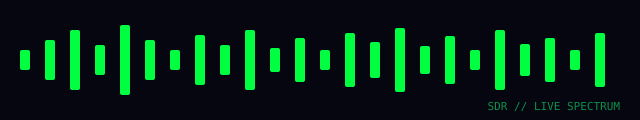
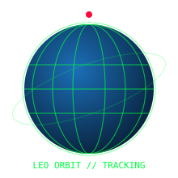

  <b>🇬🇧 <a href="README.md">English</a></b> · 🇧🇩 বাংলা

  

<h1 align="center">👾 <b>আতিক শাহরিয়ার</b></h1>
<h3 align="center"><i>ভাঙো · বানাও · উড়িয়ে দাও</i> — Black-Hat মনোভাব · White-Hat নৈতিকতা</h3>

  

  
  

---

## 🧑‍ আমার সম্পর্কে
- 🔐 **সাইবার সিকিউরিটি পেশাদার (ভবিষ্যৎ)** — দুর্বলতা আগে খুঁজে বের করি, তারপর বন্ধ করি।
- 💻 **ফুল-স্ট্যাক ডেভেলপার** — Next.js / React / Node / Python, UI থেকে API পর্যন্ত।
- 📡 **রেডিয়ো ও SDR** — আকাশ থেকে সিগন্যাল ধরা, স্যাটেলাইট ডিকোড।
- 🚀 **অ্যান্টোনাট ও আকাশগঙ্গার শখ** — অরবিট, টেলিমেট্রি, মিশন-ক্রিটিক্যাল কোড।
- 🌍 **লোকাল-ফার্স্ট ও প্রাইভেসি-প্রিয়** — ব্যবহারকারীকে সম্মান করা টুল বানাই।

## 🛠️ টেক স্ট্যাক

  
  
  
  
  
  
  

## 📡 রেডিয়ো · স্যাটেলাইট · আকাশ

   
  🌊 লাইভ SDR স্পেকট্রাম

   
  🛰️ LEO ট্র্যাকিং

## 📊 লাইভ পরিসংখ্যান

  
  

## 🚀 ফিচার্ড প্রজেক্ট

## ☕ সাপোর্ট ও ডোনেট

  

## 📫 যোগাযোগ

  
  

---

### 💀 *"কিছুই বিশ্বাস করো না। সব যাচাই করো। তারপর সুন্দর কিছু বানাও।"*

