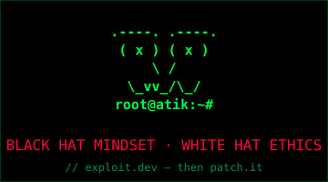
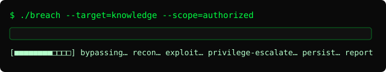
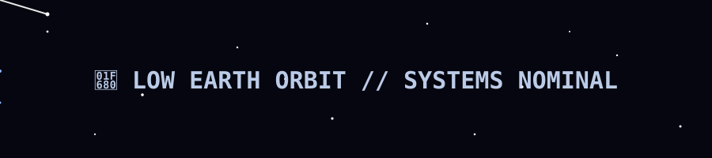

<p align="center">
  
</p>

<p align="center">
  
</p>

<h1 align="center">👾 <b>ATIK SHAHRIAR</b></h1>
<h3 align="center"><i>break it · build it · launch it</i> — Black-Hat Mindset · White-Hat Ethics</h3>

<p align="center">
  
</p>

<p align="center">
  
  
  
  
</p>

---

<p align="center">
  
</p>

<table align="center">
  <tr>
    <td align="center" width="50%">
      <br>
      <sub>📡 <b>SDR / SATCOM</b> — scanning the bands</sub>
    </td>
    <td align="center" width="50%">
      <br>
      <sub>🚀 <b>Aeronautics / Space</b> — systems nominal</sub>
    </td>
  </tr>
</table>

---

## 🧑‍💻 whoami.txt
```
┌─[atik@blackhat]─[~/profile]
└── $ cat whoami.txt
    🔓  Red-team mindset — I find the hole before someone else does.
    💻  Full-stack: UI → API → DB → deploy, secure by default.
    📡  Pulling signals from the sky: SDR, amateur radio, satellites.
    🛰️  Downlink telemetry, decode, and plot — from LEO to ground station.
    🚀  Space & aeronautics: orbits, mission-critical, failure-is-not-an-option.
    ☕  Fueled by curiosity, coffee, and 3 a.m. debugging sessions.
```

---

## 🛠️ Arsenal — Languages & Frameworks
<p align="center">
  
  
  
  
  
  
  
  
</p>

## 🛡️ Offense & Defense — Security Toolkit
<p align="center">
  
  
  
  
  
  
  
</p>

## 📡 Radio · Satellite · Aeronautics
<p align="center">
  
  
  
  
  
</p>

## 🎖️ Platforms & CTF
<p align="center">
  
  
  
  
</p>

---

## 🏅 Certifications & Targets
> _🔑 edit this list with the certs you actually hold / are pursuing._

<p align="center">
  
  
  
  
</p>

## 🎓 Education Timeline
```
20__ ──▶  Foundations: networking, Linux, C/Python
20__ ──▶  Web & app security · OWASP Top 10 · red-team labs
20__ ──▶  SDR / satellite comms · orbital mechanics (self-study)
NOW   ──▶  Full-stack + security engineering · building in public
```
> _🔑 replace `20__` with your real years / institution._

## 🖥️ My Rig / Setup
```
OS      : Kali Linux / Windows 11 (dual)
Editor  : VS Code + Neovim
Shell   : zsh + tmux
Radio   : RTL-SDR · handheld transceiver
Stack   : Next.js · Node · Python · Docker
Focus   : AppSec · WebRTC · SDR · local-first tools
```

---

## 📻 Station Identity
```
CALLSIGN : 🔑 VU2______   (put your amateur callsign here)
GRID     : 🔑 NL-__ (Maidenhead locator)
```
**🛰️ Worked / decoded satellites (QSL):** `NOAA-18` · `NOAA-19` · `ISS (APRS)` · `SO-50` — _🔑 edit with your real log_

**🌍 ISS downlink (live-ish waveform):**
```
▁▂▅▆▇█▇▆▅▃▂▁▂▃▅▆▇█▆▅▃▂▁   telemetry · 145.800 MHz · doppler-corrected
```

---

## 📜 Responsible Disclosure
I report vulnerabilities **privately and ethically** to vendors and never exploit without authorization. Found an issue in one of my projects? Email me — I respond and credit reporters.

---

## 📊 Live System Telemetry
<p align="center">
  
  
  
  
</p>

### 🗓️ Contribution Calendar
<p align="center"></p>

### 🧊 3D Contribution Grid (animated)
<p align="center"></p>

### 🐍 Contributions, animated
<p align="center"></p>

---

## 🚀 Featured Project
<a href="https://github.com/AtikShahriar01/chatbox">
  
</a>
<a href="https://github.com/AtikShahriar01/chatbox"></a>
> _🔑 pin your best repos too: profile page → "Customize your pins"._

## 🛠️ Currently On The Workbench
- 🔭 Building: **Chatbox** + a **satellite telemetry dashboard**
- 🌱 Learning: **web exploitation, SDR decoding, orbital mechanics**
- 👯 Collaborate on: **security tooling & full-stack builds**
- 💬 Ask me about: **OWASP Top 10, P2P security, radio propagation**

---

## ☕ Support & Donate
> ❤️ Fuel the caffeine + antenna budget:

<p align="center">
  <a href="https://github.com/sponsors/AtikShahriar01"></a>
  <a href="#"></a>
  <a href="#"></a>
  <a href="#"></a>
</p>

---

## 📫 Transmit / Connect
<p align="center">
  <a href="https://github.com/AtikShahriar01"></a>
  <a href="mailto:atiksoykot919@gmail.com"></a>
  <a href="#"></a>
  <a href="#"></a>
  <a href="https://github.com/AtikShahriar01/chatbox"></a>
</p>

---

<div align="center">

### 💀 *"Trust nothing. Verify everything. Then build something beautiful."*

**⭐ Drop a star — it keeps the antenna pointed up.** 🛰️


</div>

<!--
  🔑 TO CUSTOMIZE (search "🔑" in this file):
  callsign + grid, worked satellites, certification years/status,
  education years/institution, donate links (BMC/Ko-fi/PayPal), LinkedIn/X URLs.
-->
